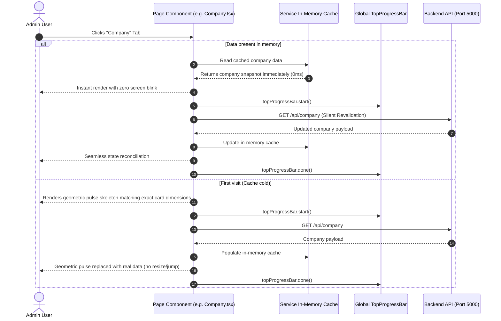

# Sell Digital Assets Admin Console — System Architecture & Technical Specifications

> **System**: Administrative Observability & Platform Management Portal (`sell-digital-assets-admin`).  
> **Tech Stack**: React 19, TypeScript 6 (Strict Mode), Vite 8, Tailwind CSS v4, Sonner, Zod, Lucide React.  
> **Deployment Target**: Vercel (Edge CDN + SPA Rewrites).

---

## 1. Architectural Overview

The `sell-digital-assets-admin` console provides system-wide operational observability, singleton company configuration, user directory administration, and credential governance for the Sell Digital Assets platform. Engineered with a **Zero-Mock, Zero-CLS** philosophy, all presentation components render against live PostgreSQL records via the backend REST API (`sell-digital-assets-api`).

```mermaid
graph TD
    AdminUser([Administrator]) --> AdminApp[Admin Console Shell]
    
    subgraph "sell-digital-assets-admin"
        AdminApp --> TopProgress[Global Top Progress Bar (Non-blocking)]
        AdminApp --> AuthGuard{Auth Route Guard}
        
        AuthGuard -->|Authenticated| LayoutShell[Layout Shell (Header, Sidebar, Main, Footer)]
        AuthGuard -->|Unauthenticated| LoginPage[Login Portal (Zod + Remember Me)]
        
        LayoutShell --> PageDashboard[Dashboard: Real-time KPIs & Activity]
        LayoutShell --> PageCompany[Company: Branding, Singleton & Currencies]
        LayoutShell --> PageUsers[Users: Directory, Roles & Statuses]
        LayoutShell --> PageSetting[Setting: Profile & Password Governance]
        
        PageDashboard & PageCompany & PageUsers & PageSetting --> ServiceCache[In-Memory SWR Client Cache]
        ServiceCache --> APIClient[API Service Client]
    end
    
    APIClient -->|HTTPS REST| BackendAPI[("sell-digital-assets-api (Port 5000)")]
```

---

## 2. Universal Loading Pattern & In-Memory Cache (CLS = 0)

To guarantee zero layout shift (Cumulative Layout Shift = 0) and instantaneous tab switching:



---

## 3. Directory & File Organization

```text
sell-digital-assets-admin/
├── public/                     # Static assets (favicons, manifest)
├── src/
│   ├── assets/                 # Plus Jakarta Sans variable font
│   ├── components/
│   │   └── ui/                 # Reusable UI primitives (Button, Card, Input, Checkbox, Badge, Modal, Spinner, TopProgressBar)
│   ├── config/                 # Environment variables (env.ts)
│   ├── context/                # Theme and Auth context definitions
│   ├── hooks/                  # Custom hooks (useAuth, useTheme)
│   ├── layouts/                # Layout shells (Header, Sidebar, Footer, Layout)
│   ├── lib/
│   │   ├── icons/              # Unified SVG icon library (Coins, Wallet, Banknote, Currency, etc.)
│   │   └── utils.ts            # Class merging utility (cn)
│   ├── pages/                  # Top-level administrative page views
│   │   ├── Dashboard.tsx       # System performance & real-time metric cards
│   │   ├── Company.tsx         # Platform branding, currencies, & singleton settings
│   │   ├── Setting.tsx         # User profile, display name, and password update
│   │   └── Login.tsx           # Authentication portal with Zod validation
│   ├── provider/               # Context providers (ThemeProvider, AuthProvider)
│   ├── schemas/                # Zod validation schemas (loginSchema.ts)
│   ├── services/               # HTTP client & in-memory caching layer
│   │   ├── authService.ts      # Login, session refresh, token persistence
│   │   └── companyService.ts   # Company singleton, currency options & formatters
│   ├── theme/                  # Material 3 design tokens & Tailwind CSS v4 stylesheets
│   ├── types/                  # Domain TypeScript interfaces (auth.ts, company.ts)
│   ├── App.tsx                 # Root router & authentication route guard
│   └── main.tsx                # Client application bootstrap
├── eslint.config.js            # Flat ESLint configuration
├── package.json
├── tsconfig.app.json
└── vite.config.ts              # Vite bundler configuration & /api dev proxy
```

---

## 4. Currency Engine & Financial Presentation Architecture

1. **Generic Iconography**:
   - The UI avoids hardcoded currency symbols in icons. Semantic icons (`<Icons.Coins>`, `<Icons.Wallet>`, `<Icons.Currency>`) from `@/lib/icons` represent financial fields neutrally.
2. **PostgreSQL-Driven Currency Selection**:
   - The Company Edit Modal pulls active currency records directly from the database `currencies` table (`GET /api/company/currencies`).
   - Selecting a new currency automatically updates the currency symbol (`₨`, `$`, `€`, `£`, `¥`) in real time across the form and labels.
3. **Dynamic Currency Formatting**:
   - All monetary amounts are formatted through `formatCurrencyAmount(amount, symbol)` located in `src/services/companyService.ts`.

---

## 5. Security & Authentication Architecture

1. **Dual Storage Strategy**:
   - **Remember Me checked**: Tokens stored in `localStorage` for multi-day persistent sessions.
   - **Remember Me unchecked**: Tokens stored in `sessionStorage` for single-session tab security.
2. **Clean Logout Guarantee**:
   - Triggering `signOut()` scrubs all token keys from both `localStorage` and `sessionStorage`, resets the React auth state, and wipes all in-memory service caches.
3. **Notification-Only Error Dispatch**:
   - HTTP errors (`400`, `401`, `403`, `429`, `500`) are converted directly to Sonner toast notifications (`toast.error(...)`). Zero layout-disrupting error banners.

---

## 6. Build & Verification Standards

```powershell
# Type checking
npx tsc -b

# Linting (Zero warnings / Zero errors)
npm run lint

# Production build test
npm run build
```

