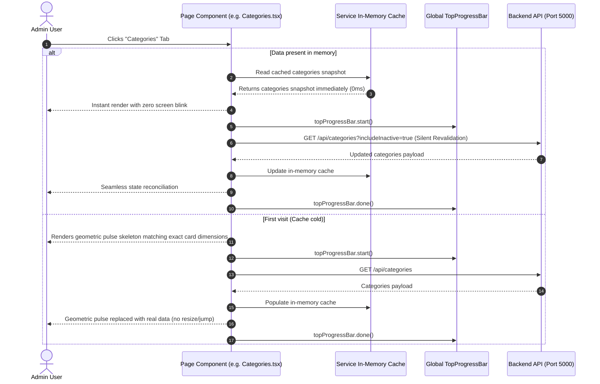

# Sell Digital Assets Admin Console — System Architecture & Technical Specifications

> **System**: Administrative Observability & Platform Management Portal (`sell-digital-assets-admin`).  
> **Tech Stack**: React 19, TypeScript 6 (Strict Mode), Vite 8, Tailwind CSS v4, Sonner, Zod, Lucide React.  
> **Deployment Target**: Vercel (Edge CDN + SPA Rewrites).

---

## 1. Architectural Overview

The `sell-digital-assets-admin` console provides system-wide operational observability, singleton organization configuration, user directory administration, category taxonomy management, dynamic appearance governance, and administrator credential management for the Sell Digital Assets ecosystem. Engineered with a **Zero-Mock, Zero-CLS** philosophy, all active presentation components render directly against PostgreSQL records via the backend REST API (`sell-digital-assets-api`).

```mermaid
graph TD
    AdminUser([Administrator]) --> AdminApp[Admin Console Shell]
    
    subgraph "sell-digital-assets-admin"
        AdminApp --> TopProgress[Global Top Progress Bar (Non-blocking)]
        AdminApp --> AuthGuard{Auth Route Guard}
        
        AuthGuard -->|Authenticated| LayoutShell[Layout Shell: Header, Sidebar, Main, Footer]
        AuthGuard -->|Unauthenticated| LoginPage[Login Portal: Zod Schema + Remember Me]
        
        LayoutShell --> PageDashboard[Dashboard: Real-time Telemetry & KPIs]
        LayoutShell --> PageUsers[Users: Directory, Roles & Statuses]
        LayoutShell --> PageCategories[Categories: Taxonomy Tree, CRUD & Restore]
        LayoutShell --> PageBranding[Branding: Legal Entity, Logos & Favicons]
        LayoutShell --> PageAppearance[Appearance: Dynamic Theme Palettes & CSS Variables]
        LayoutShell --> PageSettings[Settings: Platform Currencies, Fees & Payouts]
        LayoutShell --> PageSecurities[Securities: Display Name & Password Governance]
        LayoutShell --> PageEmptyStates[Empty States: Analytics, Assets, Orders, Audit Logs]
        
        PageDashboard & PageUsers & PageCategories & PageBranding & PageAppearance & PageSettings & PageSecurities --> ServiceCache[In-Memory SWR Client Cache]
        ServiceCache --> APIClient[API Service Client]
    end
    
    APIClient -->|HTTPS REST| BackendAPI[("sell-digital-assets-api (Port 5000)")]
```

---

## 2. Zero-Mock & Unimplemented Modules Architecture

All active presentation state strictly originates from live backend REST endpoints and PostgreSQL database tables.
For roadmap modules that do not yet have corresponding backend APIs:
- **Side Navigation Topology**: Navigation items (`Analytics`, `Assets`, `Orders`, `Audit Logs`) are maintained in `Sidebar.tsx` to preserve information architecture.
- **Empty State Display**: The target page view strictly renders with the `<EmptyState />` UI primitive with zero mock data, zero fake KPI calculations, and zero synthetic metrics.
- **Display Fallbacks**: Absent database records must display neutral dashes (`—`), never hardcoded example emails, dummy locations, or fictional identities.

---

## 3. Universal Loading Pattern & In-Memory Cache (CLS = 0)

To guarantee zero layout shift (Cumulative Layout Shift = 0) and instantaneous tab switching:



---

## 4. Directory & File Organization

```text
sell-digital-assets-admin/
├── public/                     # Static assets (favicons, manifest, logo.png)
├── src/
│   ├── assets/                 # Plus Jakarta Sans variable font
│   ├── components/
│   │   └── ui/                 # Reusable UI primitives (Button, Card, Input, Checkbox, Badge, Modal, Spinner, TopProgressBar)
│   ├── config/                 # Environment variables (env.ts)
│   ├── context/                # Theme and Auth context contracts
│   ├── hooks/                  # Custom hooks (useAuth, useTheme)
│   ├── layouts/                # Layout shells (Header, Sidebar, Footer, Layout)
│   ├── lib/
│   │   ├── icons/              # Unified SVG icon library (semantic.tsx, brands.tsx)
│   │   └── utils.ts            # Class merging utility (cn)
│   ├── pages/                  # Administrative page views
│   │   ├── Dashboard.tsx       # System overview, telemetry & metrics
│   │   ├── Analytics.tsx       # Analytics empty state
│   │   ├── Users.tsx           # User directory, role assignment & account status toggling
│   │   ├── Assets.tsx          # Assets empty state with deep link to Categories
│   │   ├── Categories.tsx      # Taxonomy tree, category CRUD, soft-delete & restore
│   │   ├── Orders.tsx          # Orders empty state
│   │   ├── Branding.tsx        # Legal entity, title, logos, favicon & support contacts
│   │   ├── Appearance.tsx      # Theme palette editor, preset colors & dynamic CSS sync
│   │   ├── Settings.tsx        # Default currency, platform fee %, payout minimum & tax ID
│   │   ├── Securities.tsx      # Admin display name update, password change & token audit
│   │   ├── AuditLogs.tsx       # Audit logs empty state
│   │   └── Login.tsx           # Authentication portal with Zod validation & Remember Me
│   ├── provider/               # Context providers (ThemeProvider, AuthProvider)
│   ├── schemas/                # Zod validation schemas (loginSchema.ts)
│   ├── services/               # HTTP client & in-memory caching layer
│   │   ├── apiClient.ts        # Centralized fetch client, token attachment, auto-refresh & TopProgressBar
│   │   ├── authService.ts      # Login, session refresh, token persistence & password update
│   │   ├── categoryService.ts  # Categories CRUD, tree hierarchy, soft-delete & restore
│   │   ├── organizationService.ts # Organization singleton, currency options & formatters
│   │   ├── themeService.ts     # Active theme retrieval, palette update & applyThemeToDom
│   │   └── userService.ts      # User directory pagination, role update, status toggling & create
│   ├── theme/                  # Material 3 design tokens & Tailwind CSS v4 stylesheets
│   ├── types/                  # Domain TypeScript interfaces (auth.ts, organization.ts)
│   ├── App.tsx                 # Root application router, modal dialogs & auth guard
│   └── main.tsx                # Client application bootstrap
├── eslint.config.js            # Flat ESLint configuration
├── package.json
├── tsconfig.app.json
├── vercel.json                 # Vercel deployment & SPA rewrite routing
└── vite.config.ts              # Vite bundler configuration & /api dev proxy (Port 5174)
```

---

## 5. Currency Engine & Financial Presentation Architecture

1. **Generic Iconography**:
   - The UI avoids hardcoded currency symbols in icons. Semantic icons (`<Icons.Coins>`, `<Icons.Wallet>`, `<Icons.Currency>`) from `@/lib/icons` represent financial fields neutrally.
2. **PostgreSQL-Driven Currency Selection**:
   - The platform settings view pulls active currency records directly from the database `currencies` table (`GET /api/organizations/currencies`).
   - Selecting a new currency updates the currency symbol (`₨`, `$`, `€`, `£`, `¥`) in real time across the form and labels.
3. **Dynamic Currency Formatting**:
   - All monetary amounts are formatted through `formatCurrencyAmount(amount, symbol)` located in `src/services/organizationService.ts`.

---

## 6. Dynamic Appearance & Theming Architecture

1. **Active Palette Governance**:
   - Operators can select preset palettes or customize individual color hex values in `src/pages/Appearance.tsx`.
   - Palette modifications are submitted via `PUT /api/theme/active`, updating the active theme in PostgreSQL.
2. **Client DOM Application**:
   - `applyThemeToDom()` in `src/services/themeService.ts` maps hex color values to CSS custom properties (`--md-sys-color-primary`, `--md-sys-color-surface`, etc.) on `:root`.
3. **Zero-FOUC Initial Paint**:
   - An inline script in `index.html` resolves the active theme before rendering the first frame.

---

## 7. Security & Authentication Architecture

1. **Dual Storage Strategy**:
   - **Remember Me checked**: Tokens stored in `localStorage` for multi-day persistent sessions.
   - **Remember Me unchecked**: Tokens stored in `sessionStorage` for single-session tab security.
2. **Clean Logout Guarantee**:
   - Triggering `signOut()` clears tokens from both `localStorage` and `sessionStorage`, resets React auth state, and purges all service in-memory caches (`organizationService`, `userService`, `categoryService`, `themeService`).
3. **Notification-Only Error Dispatch**:
   - HTTP errors (`400`, `401`, `403`, `429`, `500`) are converted directly to Sonner toast notifications (`toast.error(...)`). Zero layout-disrupting error banners.

---

## 8. Build & Verification Standards

```powershell
# Type checking (Strict Mode)
npx tsc -b

# Linting (Zero warnings / Zero errors)
npm run lint

# Production build test
npm run build
```
